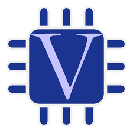

Hello, feel free to look around!

:school: Sacramento State University 2022  
:heavy_check_mark:Main Language: Python  
:mailbox_with_mail: Email : dquint54@gmail.com  

  
 
Current Projects im working on:  
 	:computer: Youtube Shorts and Python Automation using Selenium  
  
 
 
 

Known Languages: 

         

 

IDE/Software:

 

<!--
**dquint54/dquint54** is a ✨ _special_ ✨ repository because its `README.md` (this file) appears on your GitHub profile.

Here are some ideas to get you started:

- 🔭 I’m currently working on ...
- 🌱 I’m currently learning ...
- 👯 I’m looking to collaborate on ...
- 🤔 I’m looking for help with ...
- 💬 Ask me about ...
- 📫 How to reach me: ...
- 😄 Pronouns: ...
- ⚡ Fun fact: ...
-->
